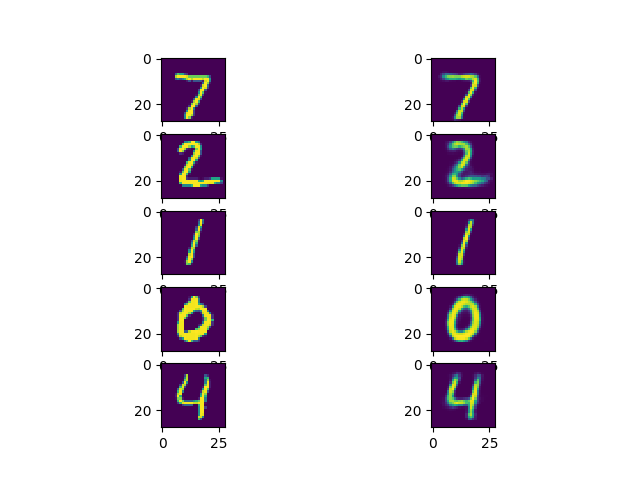
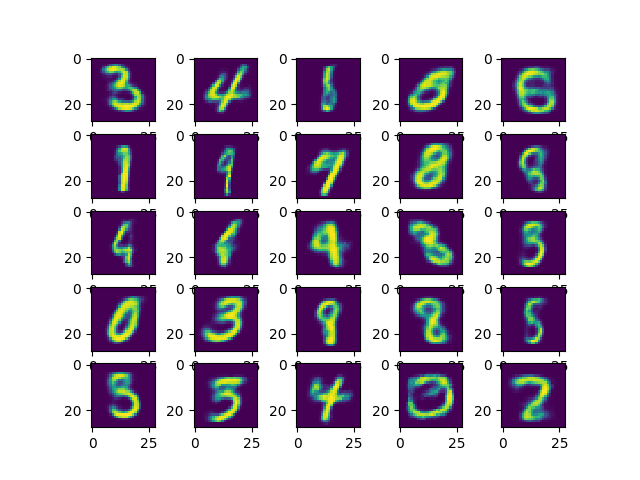

# Variational Autoencoders

Variational Autoencoders is a generative learning algorithm that projects the data in lower dimensional space and reconstructs image from the latent space (lower dimensional space). The Encoding-Decoding is done via neural networks. We try to make the distribution in latent space as standard gaussian. Thus the total loss function is equal to sum of difference between reconstructed images and true images plus the KL divergence between distributioin of latent variable and standard gaussian.

### Usage
To use the class VariationalAutoEncoder use the following procedure :

```python
model = VariationalAutoEncoder(latent_dim)
# train the data externally as :
total_loss,generation_loss,latent_loss = model.Run_a_Batch(training_batch)

#----------------------------------------x  Training Complete   x------------------------------------------#

# Now to test the model

# To reconstruct images :
reconstructed_images = model.reconstructor(test_images)

# To generate images :
generated_images = model.generator(np.random_normal(size=[num_images,latent_dim]))

# Images have been assumed to be 28x28 and flattened to row
```

### Results

#### Reconstruction
These are the reconstructed images :

#### Generation
These are some generated images from program :



### References
* [Paper by Kingman and Welling](https://arxiv.org/pdf/1312.6114.pdf)
* [A very nice tutorial by Carl Doersch](https://arxiv.org/pdf/1606.05908.pdf)
* [A nice tutorial](http://kvfrans.com/variational-autoencoders-explained/)
* [Another nice tutorial](https://jaan.io/what-is-variational-autoencoder-vae-tutorial/)